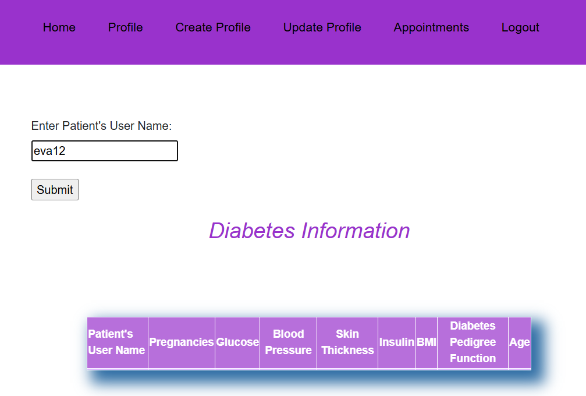
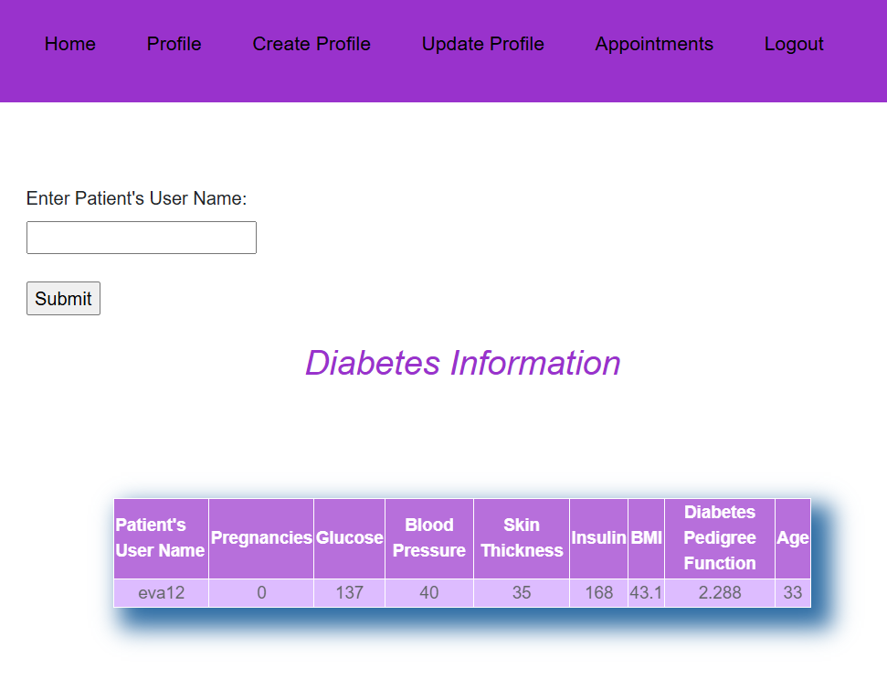

## Machine Learning Based Diabetes Prediction and Doctor Appointment System
<small> A Machine Learning Based Diabetes Prediction and Doctor Appointment System predicts diabetes risk using patient data and allows users to book doctor appointments. Features include user registration, health data input, prediction results, appointment scheduling, cancelling appointment. These system has three types of users: patient, doctor, and admin. These are the features of this system for each type of users:
Patient: View doctor list (find doctor), book doctor's appointment, test diabetes by giving their health data as input.
Doctor: View appointments, view patient's information.
Admin: Add new doctor, view appointments of doctors, view information of all doctors.
Every type of user can do registration, login, logout, create profile, and update profile. </small> 

Django follows the MVC (Model–View–Controller) pattern. Functionalities of view include displaying webpages, accepting requests from users, rendering webpages, etc. Functionalities of model include storing data in the database, fetching data from the database, deleting data, updating data, etc. The controller accepts the user request from the view. The controller fetches data from the model, and the model gives the requested data to the controller. The controller sends these requested data to the user through the view. The controller renders the requested webpage to the user through the view. In Django, urls.py performs the functionalities of the view of MVC, views.py performs both the functionalities of the view and controller of MVC, and models.py performs the functionalities of the model of MVC. In Django, when a user clicks on a link on a webpage, the system searches for that URL in the urls.py file. In the urls.py file, a function will be present corresponding to that URL. This function will be fully written in a particular views.py file. So, in Django, when a user clicks on a link on a webpage, the system finds that URL in urls.py, goes to its corresponding function (written in views.py), and performs the actions written in that function. 

### Final Result of Project
#### Login Page

#### Registration form for new users

The registration form is built using Django’s form handling system. When the user submits the form, request.method =="POST" is used to check whether the data is coming from the submitted form. UserRegistrationForm is used to take input from the user and form.is_valid() checks whether the given input is valid or not. If the input is valid, the user is created and authenticated using new_user = authenticate (username = uname,password=psw). render(request, 'user/register.html', context) is used to load the registration page and display the form.

### Patient Page

### Find Doctor
In this page, all the doctor records are fetched from the Add_doctor model and displayed on the webpage. The list of doctors is fetched and shown using render(request, 'user/ all_doctor.html', context).

### Book Doctor's Appointment
In this form, request.method=="POST" checks whether the form is submitted by the user. TakeAppointmentForm takes the user’s input and take_ appointment_ form .is_ valid() checks if the given data is valid or not. If it is valid, the form data is saved and the page made_appointment.html is displayed, otherwise the same form page take_appointment.html is reloaded.

### Test Diabetes
In this page, when the user submits the form, request.method=='POST' is used to check whether the data is coming from the submitted form. The system reads the diabetes dataset using pd.read_csv() and divides the dataset into training and testing parts. Then a LogisticRegression() model is used and trained using the training data from csv file. The user input values are taken from the form, converted into float type, saved into the Diabetes_info table, and then passed to the trained model as test data for prediction. Finally, based on the prediction result (Positive or Negative), the output is displayed on the webpage using render(request, 'user/test.html', {"res": result}).

### Doctor Page

#### Create Profile Form
In this form, when the user submits the form, request.method=="POST" checks whether the data is coming from the submitted form. CreateForm takes the input from the user and createform.is_valid() checks whether the given input is valid or not. If the input is valid, the data is saved in the database and the user is redirected to the home page. Otherwise the form is again displayed if there is any error.

#### Update Profile Form
In this page, profile update is done using normal input fields, not a Django crispy form. The values entered by the user are received through these input fields and stored in a dictionary called dict=request.POST. The data from this dictionary is used to update the doctor’s info and saved in the database.

#### Doctor's Appointments
In this page, when request.method=='POST', it means the doctor has submitted his ID. All the appointments corresponding to that doctor's ID are fetched from Take_appointment table. Finally, render(request, 'user/ my_appointment.html', context) is used to display the list of appointments on the webpage.

#### Patient's Info
In this page, when request.method=='POST', it means the patient's user name is coming from a submitted form. The username is taken from the form using dictionary and the corresponding data to that patient's user name, is fetched from the Diabetes_info table. Then render(request,'user/ diabetes_info.html',context) is used to display that data on the webpage.

### Admin Page

#### Adding New Doctor Form
This form is built to add a new doctor to the system. When request.method=="POST", it takes input from AddDoctorForm and checks if it is valid using add_ doctor _form .is _valid (). Then saves the doctor info into Add_doctor table and redirects to home page. If there is something ivalid while submitting the form, render(request, 'user/ add_doctor.html', context) is used to load the add doctor page and show the form again.

#### View All Appointments

#### View All Doctors
In this page, all doctors are fetched using Add_doctor.objects.all() from Add_doctor table and displayed on the webpage using render(request, 'user/ all_doctor.html', context). If the admin submits doctor's ID (request.method=='POST'), to delete a doctor then, the doctor is found using Add_doctor.objects.get(user_id__exact=a) and then deleted from the Add_doctor table. After that all remaining doctors' list is again fetched from Add_doctor table and displayed on the webpage.

### Database of this project
#### Diabetes Dataset Used for Machine Learning Model Training

#### All User Info Table

#### Patient Diabetes Status Table

#### Doctor List Table

#### Doctor Information Table

#### Appointments Table

